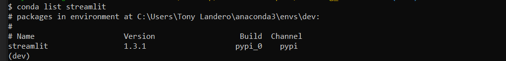
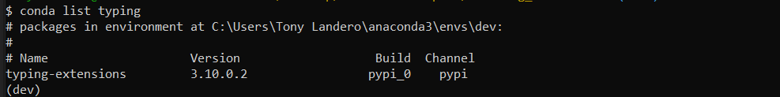
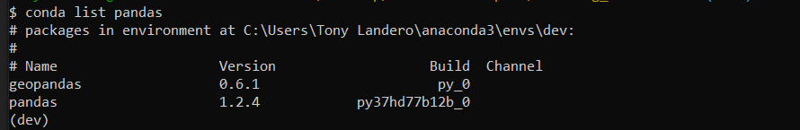

# Building_Blockchains
Will use Python and Streamlit to create an application that lets users add blocks to the blockchain and then validates the entire blockchain.

---

## Technologies

This project leverages python 3.7 with the following packages:

**[Streamlit Library](https://docs.streamlit.io/)** - Streamlit is an open-source Python library that makes it easy to create and share beautiful, custom web apps for machine learning and data science.<br>

**[Dataclasses Library](https://docs.python.org/3/library/dataclasses.html)** - This module provides a decorator and functions for automatically adding generated special methods such as __init__() and __repr__() to user-defined classes.<br>

**[Typing Library](https://docs.python.org/3/library/typing.html)** - This module provides runtime support for type hints. The most fundamental support consists of the types Any, Union, Callable, TypeVar, and Generic.<br>

**[Datetime Library](https://docs.python.org/3/library/datetime.html)** - The datetime module supplies classes for manipulating dates and times.<br>

**[Pandas Library](https://pandas.pydata.org/)** - pandas is a fast, powerful, flexible and easy to use open source data analysis and manipulation tool,
built on top of the Python programming language.<br>

**[Hashlib Library](https://docs.python.org/3/library/hashlib.html)** - This module implements a common interface to many different secure hash and message digest algorithms. Included are the FIPS secure hash algorithms SHA1, SHA224, SHA256, SHA384, and SHA512.<br>

## Installation Guide

Before running the application first install the following dependencies:

First, we need to verify that we have Streamlit installed. From your terminal, type the following command:

```python
conda list streamlit
```

If it is installed on your computer, you should see a similar message to this:



If it is not installed on your computer, you need to install it with the following command:

```python
pip install streamlit
```

That takes care of Streamlit.

Now, let's verify that the Typing Library is installed. From your terminal, type the following command:

```python
conda list typing
```
If it is installed on your computer, you should see a similar message to this:



If it is not installed on your computer, you need to install it with the following command:

```python
pip install typing
```

We are done installing the Typing Library

Next, let's verify that the Pandas Library is installed. From your terminal, type the following command:

```python
conda list pandas
```
If it is installed on your computer, you should see a similar message to this:



If it is not installed on your computer, you need to install it with the following command:

```python
pip install pandas
```

We are done with the Pandas installation.

We are now ready to start using the application.

